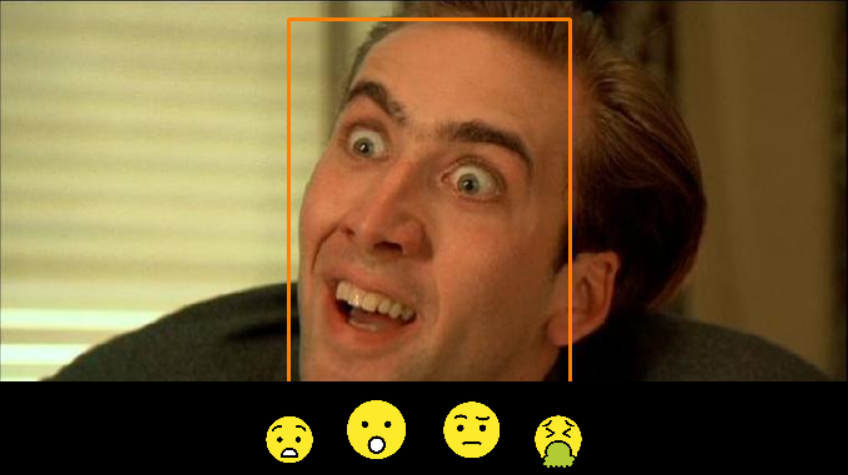
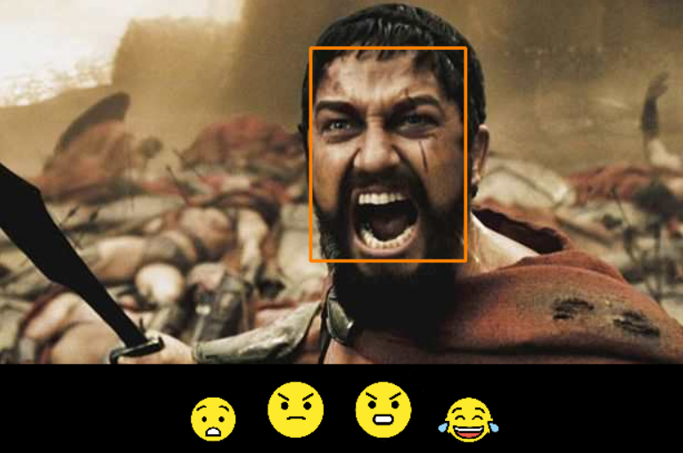
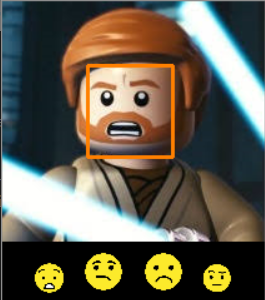
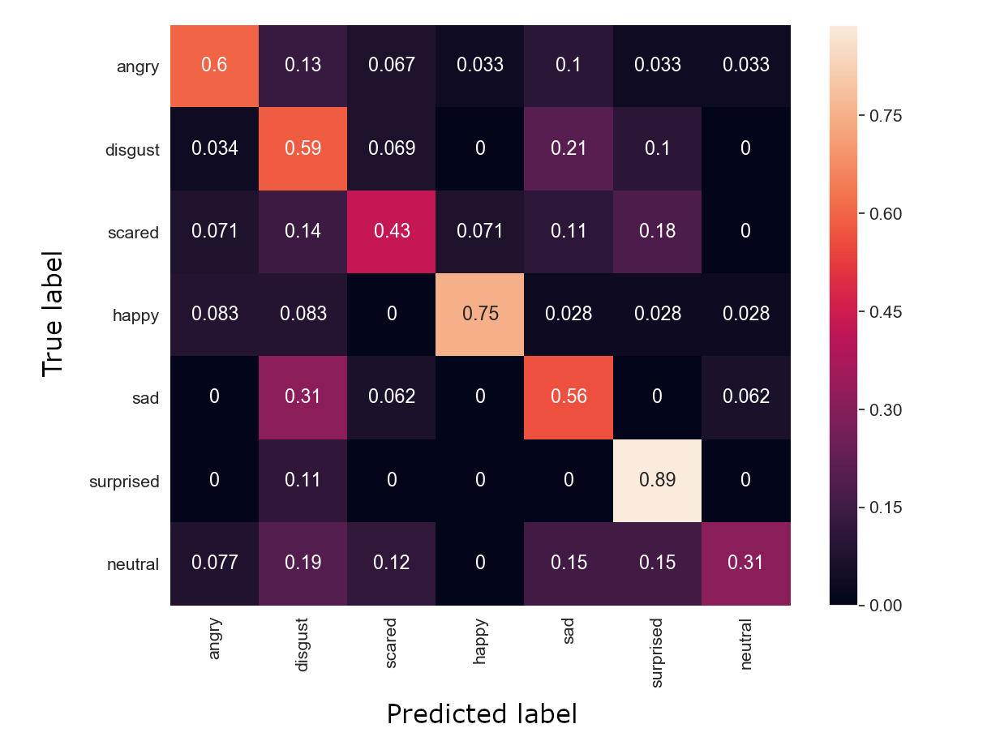

# Emojifier





Emojifier is an application that suggests emoji icons, given a face image as input. It uses a convolutional neural network to classify the image according to a facial expression it depicts, and displays emojis that fit this expression.

## Usage

### Generating dataset

```python dataset_generator.py [-h] [-o OUTPUT_DIR] [-l QUERY_LIMIT] [-d] [-e]```

The image dataset to be used for training the neural network is generated by [dataset_generator.py](https://github.com/Agere98/Emojifier/blob/master/dataset_generator.py) python script. It uses [Google Images Download](https://google-images-download.readthedocs.io/en/latest/index.html) to automatically generate labeled face images. To run the script on Windows, a [chromedriver](https://chromedriver.chromium.org/) .exe file needs to be present in the parent directory.

### Training the classifier

```python trainer.py [-h] [--num_epochs NUM_EPOCHS] [--batch_size BATCH_SIZE] [--load FILEPATH] [-d DATASET] [-b] [-v] [-s] name```

The [trainer.py](https://github.com/Agere98/Emojifier/blob/master/trainer.py) script uses transfer learning to train a classifier model. A VGGFace implementation (available [here](https://github.com/rcmalli/keras-vggface)) was used as a basis for the training process.

### Evaluating the model

```python tester.py [-h] [--batch_size BATCH_SIZE] [-d DATASET] model```

The [tester.py](https://github.com/Agere98/Emojifier/blob/master/tester.py) script can be used to calculate metrics concerning a trained classifier model and generate a confusion matrix.



### Using the actual application

```python emojifier.py [-h] [-f IMAGE] [-c CLASSIFIER]```

If you made it through the previous steps and managed to train a decent classifier, congratulations! You can now use it to entertain yourself for 5-10 minutes as it tries to match emojis to facial expression images. You can also use it to suggest emojis in real time - just skip the `-f` param and make sure you have a webcam connected.

## Neural network architecture

The model generated by the trainer script is based on the ResNet-50 architecture. It takes an image of shape (224, 224, 3) as input. The top layer was replaced by the following layers:

1. Dropout, $p=0.5$
2. Dense, $n=256$, activation: ReLU
3. Dense, $n=7$ (number of labels), activation: softmax

The output is a 7-dimensional vector consisting of numbers in $[0, 1]$ range that sum up to $1$ and represent the likelihood for each label to match the given input image.
